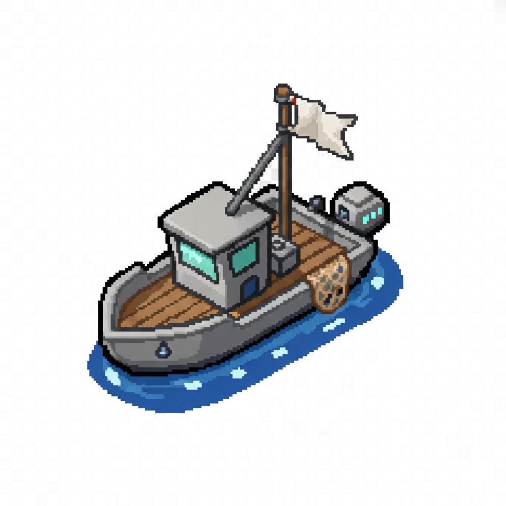
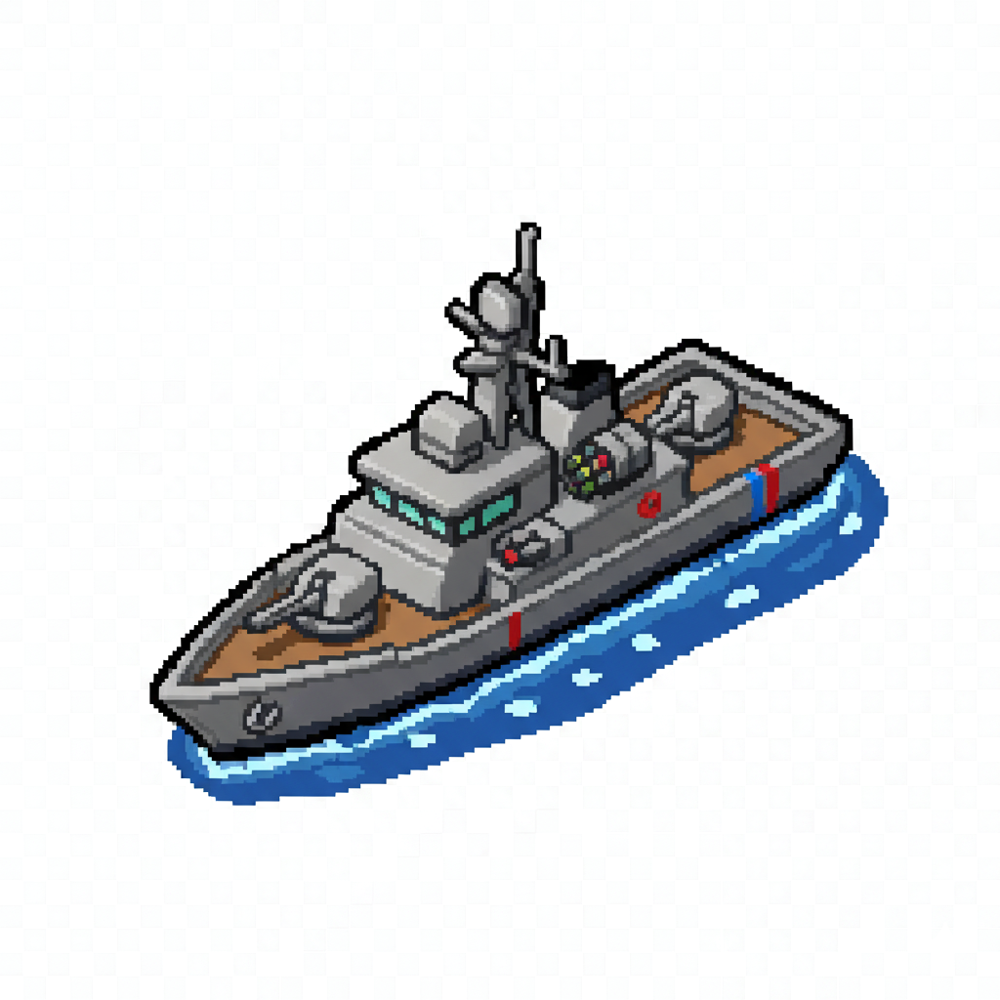
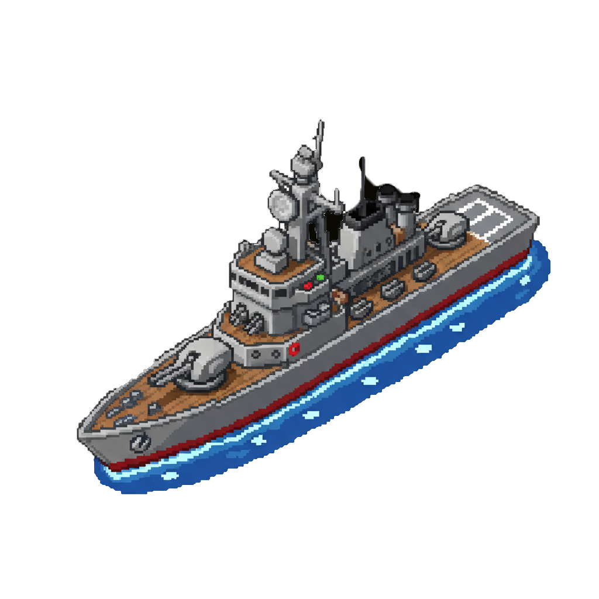
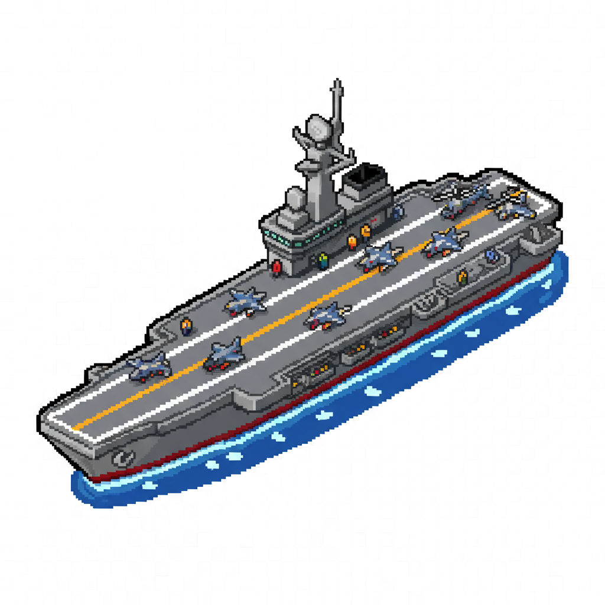

# Battleship is here!

| Vessel | Corvette | Destroyer | Carrier |
|:-------:|:---------:|:----------:|:--------:|
|  |  |  |  |

I know this is not the most impressive thing to build, but I kinda loved designing this project. I was fun!


# Configure

## `1. Install packages 📥`

```npm:
npm install
```

## `2. Build Webpack`

```
npm run build
```

The build will live in the `📁./dist`

## `3. Run development server`

```
npm run dev
```

## `4. Run deployment`
(This one is configured to `gh pages`)

`1. Create new branch > gh-pages`
```bash:
git checkout -b gh-pages
```

`2. Only add the dist folder contents`

```bash:
git add dist -f
```

`3. Deploy > $ git subtree push --prefix=./dist origin gh-pages`

```bash:
npm run deploy
```
<center>
    <h3> 🛠️ Technologies Used </h3>
    <p align="middle">
    
    
    
    
    
    </p>
</center>